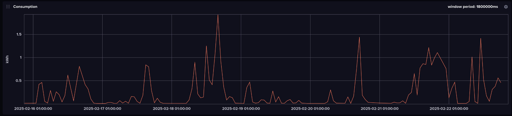
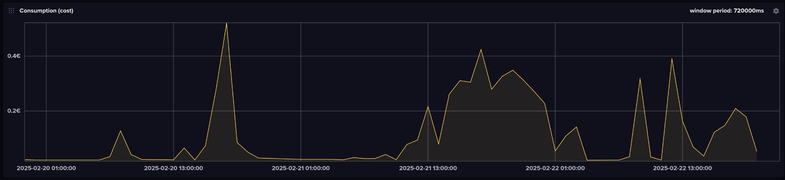
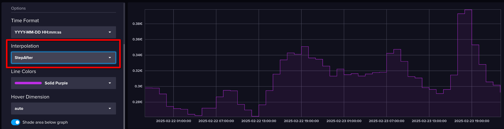

# Query examples for data created by tibberinfo-influxdb

Find below some simple InfluxDB v2 queries (Flux query language) and correspondings graphs done based on data created by `tibberinfo.py`.

### Consumption over the last week

To see the peaks of your home's electric power usage, just plot the `consumption` field of the `consumption` measurement. 

```
from(bucket: "tibber")
  |> range(start:-7d, stop: now())
  |> filter(fn: (r) => r["_measurement"] == "consumption")
  |> filter(fn: (r) => r["_field"] == "consumption")
```


If you'd rather know the monetary cost instead of the kilowatt hours, i.e. kWh multiplied by dynamic price at each point in time, query the `cost` field of the `consumption` measurement instead (I also changed the time span to three days here):

```
from(bucket: "tibber")
  |> range(start:-3d, stop: now())
  |> filter(fn: (r) => r["_measurement"] == "consumption")
  |> filter(fn: (r) => r["_field"] == "cost")
```


### Price development today and tomorrow

Tibber provides the dynamic kWh prices via their API, and tibberinfo-influxdb stores it in the database. So you have past prices available, and also up to 35h into the future (tomorrow's prices are published at 13:00 CET). With the following query you can plot these prices.

Important: set *Interpolation* to *StepAfter* (as highlighted in the screenshot), or else the graph has an offset.

```
import "date"
yesterday = date.truncate(t: -1d, unit: 1h)
tomorrow = date.truncate(t: 2d, unit: 1h) // does not actually matter, just needs to be further in the future than what we have data for
from(bucket: "tibber")
  |> range(start: yesterday, stop: tomorrow)
  |> filter(fn: (r) => r["_measurement"] == "price")
  |> filter(fn: (r) => r["_field"] == "price")
```


